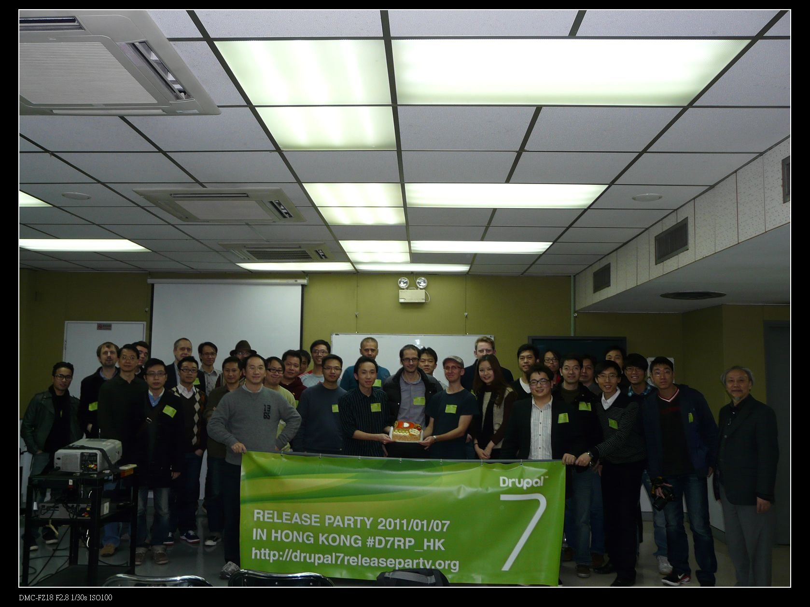
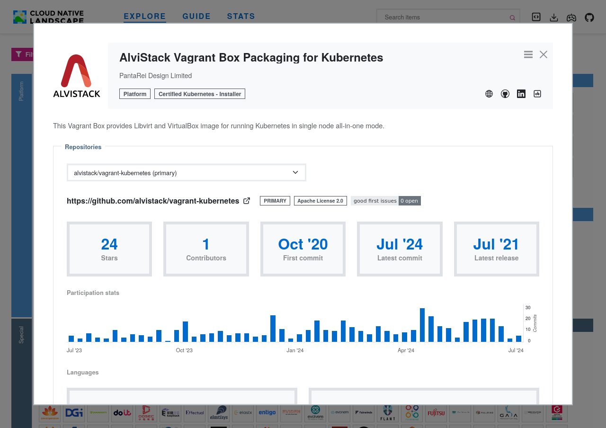
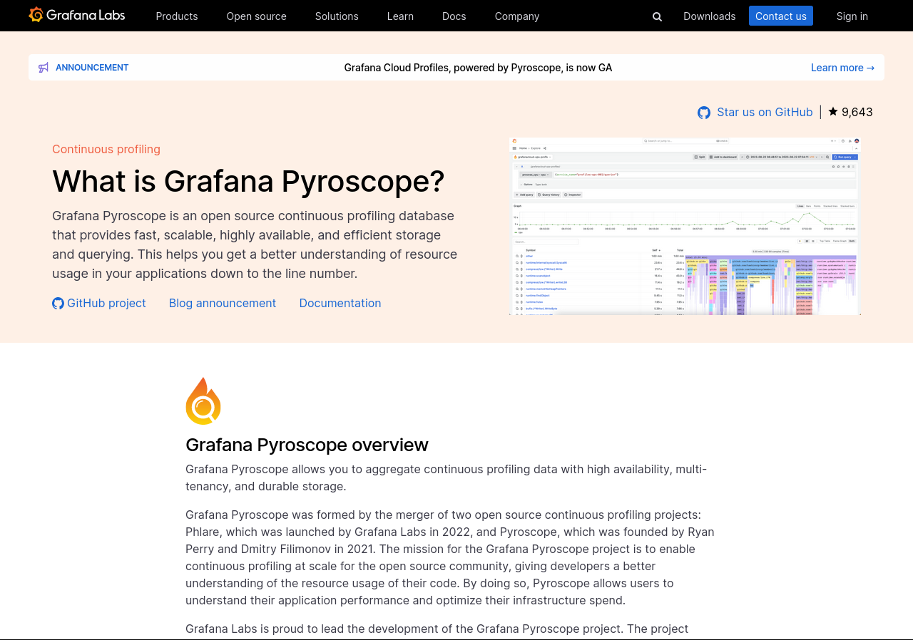

# Introduction

## Get the Code

- [GitHub Repo](https://github.com/hswong3i/metrics-logs-traces-and-profiles-grafana-lgtm): Source code
- [GitHub Page](https://hswong3i.github.io/metrics-logs-traces-and-profiles-grafana-lgtm): Online [reveal.js](https://revealjs.com/), converted by [pandoc](https://pandoc.org)
- [index.pdf](index.pdf): Offline PDF, converted by [pandoc](https://pandoc.org)
- [Vagrantfile](Vagrantfile): For running demo

------------------------------------------------------------------------

## About Me

- Wong Hoi Sing, Edison (hswong3i)
- 2005: [Drupal, Developer & Contributor](https://drupal.org/user/33940)
- 2008: [HKDUG, Founder](https://groups.drupal.org/drupalhk)
- 2010: [PantaRei Design, Founder](https://pantarei-design.com)
- 2020: [HKOSCON 2020, Speaker](https://hkoscon.org/2020/topics/ansible-vm-kubernetes)
- 2021: [AlviStack, Founder](https://landscape.cncf.io/?group=certified-partners-and-providers&item=platform--certified-kubernetes-installer--alvistack-vagrant-box-packaging-for-kubernetes)
- 2022: [HKOSCON 2022, Speaker](https://2022.hkoscon.org/edisonwong)
- 2024: [Most Active GitHub user in Hong Kong](https://github.com/gayanvoice/top-github-users/blob/main/markdown/total_contributions/hong_kong.md)

------------------------------------------------------------------------

------------------------------------------------------------------------

------------------------------------------------------------------------

------------------------------------------------------------------------

------------------------------------------------------------------------

------------------------------------------------------------------------

# What is Grafana LGTM Stack?

## Prometheus + LGTM Stack + Pyroscope

- Monitoring: Collects and stores metrics as time series data
- Logs: What is happening?
- Metrics: Is something happening?
- Traces: Where is it happening?
- Profiles: How do I fix it?
- Dashboard: Data visualization and monitoring

------------------------------------------------------------------------

## Prometheus

- [Prometheus](https://prometheus.io/) is a systems monitoring and alerting toolkit
- Multi-dimensional data model
- PromQL, a flexible query language to leverage this dimensionality
- 2nd CNCF graduated project after Kubernetes
- Apache License 2.0

------------------------------------------------------------------------

------------------------------------------------------------------------

- [Prometheus Operator](https://github.com/prometheus-operator/prometheus-operator) deploy with Kubernetes CRDs
- [kube-prometheus](https://github.com/prometheus-operator/kube-prometheus) provides example configurations for a complete cluster monitoring stack
- Here we are going to demo with [kube-prometheus-stack](https://github.com/prometheus-community/helm-charts/tree/main/charts/kube-prometheus-stack) with Helm chart style

------------------------------------------------------------------------

## Grafana

- [Grafana](https://grafana.com/oss/grafana/) is a multi-platform open source analytics and interactive visualization web application
- It can produce charts, graphs, and alerts for the web when connected to supported data sources
- AGPLv3

------------------------------------------------------------------------

------------------------------------------------------------------------

- Support multiple installation style, e.g. monolithic, microservice, or even manually
- Here we are going to demo with [distributed Helm chart style](https://grafana.com/docs/grafana/latest/setup-grafana/installation/helm/)

------------------------------------------------------------------------

## Loki

- [Loki](https://grafana.com/oss/loki) is a backend store for long-term log retention
- Designed to be very cost effective and highly scalable
- AGPLv3

------------------------------------------------------------------------

------------------------------------------------------------------------

- Suport multiple installation style, e.g. monolithic, microservice, or even manually
- Here we are going to demo with [distributed Helm chart style](https://grafana.com/docs/loki/latest/setup/install/helm/install-microservices/)

------------------------------------------------------------------------

## Tempo

- [Tempo](https://grafana.com/oss/tempo) is a distributed tracing backend
- Designed to be cost-efficient, requiring only object storage to operate
- Deeply integrated with Grafana, Prometheus, and Loki
- AGPLv3

------------------------------------------------------------------------

------------------------------------------------------------------------

- Suport multiple installation style, e.g. monolithic, microservice, or even manually
- Here we are going to demo with [distributed Helm chart style](https://grafana.com/docs/tempo/latest/setup/helm-chart)

------------------------------------------------------------------------

------------------------------------------------------------------------

## Mimir

- [Mimir](https://grafana.com/oss/mimir) is a TSDB for long-term storage for Prometheus
- Designed to be horizontally scalable, highly available, multi-tenant
- 100% Prometheus compatible
- AGPLv3

------------------------------------------------------------------------

------------------------------------------------------------------------

- Suport multiple installation style, e.g. monolithic, microservice, or even manually
- Here we are going to demo with [distributed Helm chart style](https://grafana.com/docs/mimir/latest/set-up/helm-chart)
- EXCLUDE: due to not enough VM memory

------------------------------------------------------------------------

## Pyroscope

- [Pyroscope](https://grafana.com/oss/pyroscope) is a continuous profiling database
- Designed to be fast, scalable, highly available, and efficient storage and querying
- AGPLv3

------------------------------------------------------------------------

------------------------------------------------------------------------

- Suport multiple installation style, e.g. monolithic, microservice, or even manually
- Here we are going to demo with [distributed Helm chart style](https://grafana.com/docs/pyroscope/latest/deploy-kubernetes/helm)
- EXCLUDE: due to not enough VM memory

------------------------------------------------------------------------

# Demo with AlviStack Vagrant Box

## System Requirements

- Windows 10+
- 4 Core CPU (for running a 2 Core CPU VM)
- 16GB Memory (for running a 8GB VM)
- 50GB SSD

## Install VirtualBox

- Download and install VirtualBox
- Download and install Extension Pack
- Verify result
  - `vboxmanage --version`
- <https://www.virtualbox.org/wiki/Downloads>

------------------------------------------------------------------------

## Install Vagrant

- Download and install Vagrant
- Verify Result
  - `vagrant --version`
- <https://developer.hashicorp.com/vagrant/install>

------------------------------------------------------------------------

## Prepare Vagrantfile

- Describe the type of machine
- How to configure these machines
- How to provision these machines
- <https://developer.hashicorp.com/vagrant/docs/vagrantfile>

------------------------------------------------------------------------

## `vagrant up`

- `vagrant up --provider virtualbox`
- Running VM with VirtualBox
- Configure CPU/RAM/Disk
- Configure network port mapping
- Mount `$PWD` into VM as `/vagrant`
- Provision after VM is up and running
- <https://developer.hashicorp.com/vagrant/docs/cli/up>

------------------------------------------------------------------------

## `vagrant provision`

- `vagrant provision`
- Sometime you hope to R&D and debug the provision session
- After VM up and running you could re-run the provision steps
- <https://developer.hashicorp.com/vagrant/docs/cli/provision>

------------------------------------------------------------------------

## `vagrant ssh`

- `vagrant ssh`
- SSH into VM with user `vagrant`
- Could switch as `root` with `sudo su -`
- Host `$PWD` already mount into VM as `/vagrant`
- <https://developer.hashicorp.com/vagrant/docs/cli/ssh>

------------------------------------------------------------------------

## `kubectl get node`

    root@kubernetes-1:~# kubectl get node
    NAME           STATUS   ROLES           AGE     VERSION
    kubernetes-1   Ready    control-plane   9m18s   v1.29.2

## `kubectl get pod`

    root@kubernetes-1:~# kubectl get pod --all-namespaces
    NAMESPACE      NAME                                   READY   STATUS    RESTARTS   AGE
    csi-hostpath   csi-hostpath-socat-0                   1/1     Running   0          6m36s
    csi-hostpath   csi-hostpathplugin-0                   8/8     Running   0          6m36s
    kube-system    coredns-76f75df574-2tdbp               1/1     Running   0          9m2s
    kube-system    coredns-76f75df574-g687d               1/1     Running   0          9m2s
    kube-system    kube-addon-manager-kubernetes-1        1/1     Running   0          6m48s
    kube-system    kube-apiserver-kubernetes-1            1/1     Running   0          9m18s
    kube-system    kube-controller-manager-kubernetes-1   1/1     Running   0          9m18s
    kube-system    kube-flannel-ds-kmq79                  1/1     Running   0          6m36s
    kube-system    kube-proxy-vd4qj                       1/1     Running   0          9m2s
    kube-system    kube-scheduler-kubernetes-1            1/1     Running   0          9m18s
    kube-system    snapshot-controller-7b6f9cf9b4-rj5v5   1/1     Running   0          6m36s

## Verify with Browser

- Check the result (from host, with VirtualBox port mapping enabled in Vagrantfile):
  - <http://localhost:8080>
  - INCLUDE: Prometheus, Grafana, Loki, Tempo
  - EXCLUDE: Mimir (long-term storage for Prometheus), pyroscope (continuous profiling)

------------------------------------------------------------------------

# Connect with Data Sources

# Create a Grafana Dashboard

# Q&A

## References

- [Getting started with managing your metrics, logs, and traces using Grafana](https://grafana.com/go/webinar/getting-started-with-grafana-lgtm-stack/)
- Official webinar from Grafana Labs
- For beginner with simple show case
- Around 60 mintues

------------------------------------------------------------------------

------------------------------------------------------------------------

- [Introduction to Metrics, Logs, Traces and Profiles in Grafana](https://github.com/grafana/intro-to-mltp)
- Official complete demo for Grafana LGTM stack
- For advance user with Docker + Docker Compose experience
- Around 2 hours

------------------------------------------------------------------------

------------------------------------------------------------------------

- [可觀測性宇宙的第一天 - Grafana LGTM 全家桶的起點](https://ithelp.ithome.com.tw/articles/10319012)
- Detail explanation for Grafana LGTM + Kubernetes
- For advance user with daily Kubernetes experience
- AT LEAST 6 HOURS (reading doc only...)

------------------------------------------------------------------------

------------------------------------------------------------------------

- [AlviStack Vagrant Box Packaging for Kubernetes](https://github.com/alvistack/vagrant-kubernetes)
- CNCF Certified Kubernetes on Virtual Box or Libvrt
- Simply `vagrant up` and ready for use
- May customize for Dev/CI/CD
- Around 10 minutes

------------------------------------------------------------------------

## Contact Me

- Address: Unit 326, 3/F, Building 16W, No.16 Science Park West Avenue, Hong Kong Science Park, Shatin, N.T.
- Phone: +852 3576 3812
- Fax: +852 3753 3663
- Email: <sales@pantarei-design.com>
- Web: <http://pantarei-design.com>
